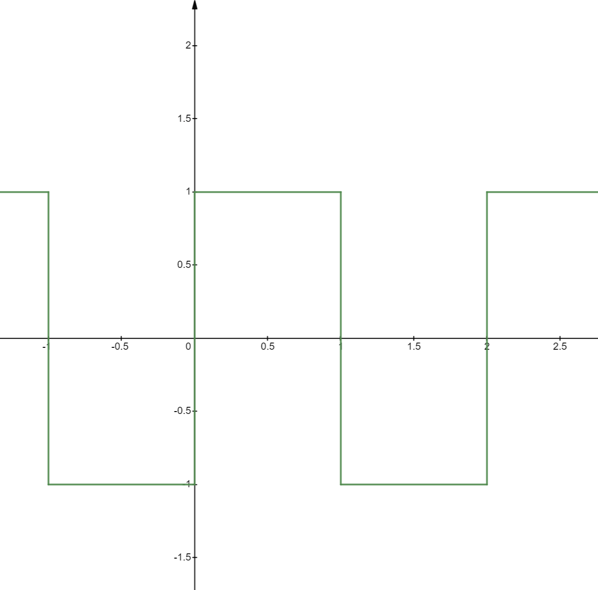
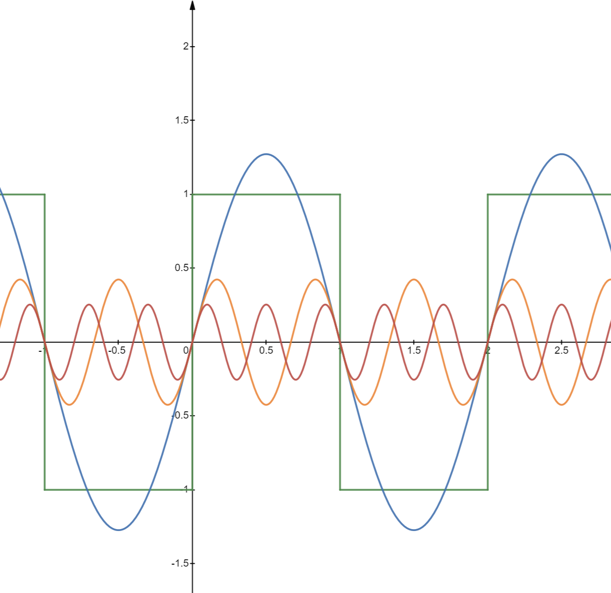
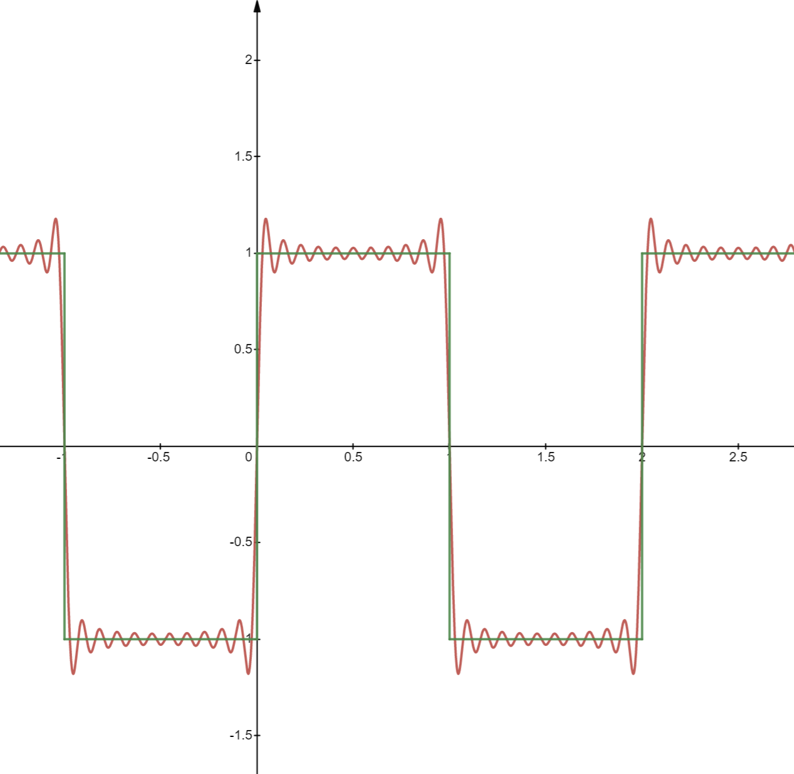

# Fourier Transform

# 1. 三角函数的正交性
一组正交基如下：
$$\{0, 1, \sin{x}, \cos{x}, \sin{2x}, \cos{2x},...\sin{nx},\cos{nx},...,\sin{mx},\cos{mx}\} $$

任意取其中的两个函数均为正交，例如

$$ \begin{aligned}\int_{-\pi}^{\pi}1\cdot\sin{x} &= 0 \\
\int_{-\pi}^{\pi}\sin{x}\cdot\cos{x} &= 0
\end{aligned}$$

如果取两个相同函数进行积分，则

$$ \begin{aligned}
\int_{-\pi}^{\pi}\cos{nx}\cdot\cos{nx}
&= \int_{-\pi}^{\pi}\frac{1}{2}(1+\cos{2nx})\\
&= \int_{-\pi}^{\pi}\frac{1}{2}+\int_{-\pi}^{\pi}\frac{1}{2}(\cos{2nx})\\
&= \pi + \frac{1}{2}\cdot\frac{1}{2n}\sin{2nx}|_{-\pi}^{\pi}\\
&= \pi + \frac{1}{4n}(\sin{2\pi}-\sin{(-2\pi)})\\
&= \pi
\end{aligned}$$

$$ \begin{aligned}
\int_{-\pi}^{\pi}\sin{nx}\cdot\sin{nx}
&= \int_{-\pi}^{\pi}\frac{1}{2}(1-\cos{2nx})\\
&= \int_{-\pi}^{\pi}\frac{1}{2}-\int_{-\pi}^{\pi}\frac{1}{2}(\cos{2nx})\\
&= \pi - \frac{1}{4n}\sin{2nx}|_{-\pi}^{\pi}\\
&= \pi
\end{aligned}$$

汇总：

$$ \begin{equation}
\left\{
\begin{aligned} \nonumber
\int_{-\pi}^{\pi}\sin{nx}\cdot\cos{mx} &= 0 \\
\int_{-\pi}^{\pi}\sin{nx}\cdot\sin{mx} &= 0, n \ne m\\
\int_{-\pi}^{\pi}\cos{nx}\cdot\cos{mx} &= 0, n \ne m
\end{aligned}
\right.\}
\end{equation}$$


# 2. 一个周期为$2\pi$的函数$f(x)$，可以展开为三角函数的加和

利用第一节中给出的正交基，可以写为：

$$ f(x) = \sum_{n=0}^{\infty}a_n\cos{nx}+\sum_{n=0}^{\infty}b_n\sin{nx} $$

更常见的写法是：（两种写法的$a_0$差了一倍）

$$ f(x) = \frac{a_0}{2} + \sum_{n=1}^{\infty}(a_n\cos{nx}+b_n\sin{nx}) \tag{1} $$

如何计算出系数 $a_0,a_1,...,a_n,b_0,b_1,...,b_n$？

## 2.1 求$a_0$
试将函数 $f(x)$ 在 $(-\pi, \pi)$ 区间进行积分，可得

$$ \int_{-\pi}^{\pi}f(x)dx = \int_{-\pi}^{\pi}\frac{a_0}{2}dx = a_0\pi $$

$$ \therefore a_0 = \frac{1}{\pi}\int_{-\pi}^{\pi}f(x)dx $$

## 2.2 求$a_n$

$$ \int_{-\pi}^{\pi}f(x)\cos{mx}dx =\int_{-\pi}^{\pi}\frac{a_0}{2}\cos{mx}dx +   \int_{-\pi}^{\pi}a_n\cos{nx}\cdot\cos{mx}dx + \int_{-\pi}^{\pi}b_n\sin{nx}\cdot\cos{mx}dx$$

其中第一项 $\int_{-\pi}^{\pi}\frac{a_0}{2}\cos{mx}dx = 0$，第三项 $\int_{-\pi}^{\pi}b_n\sin{nx}\cdot\cos{mx}dx = 0$，所以

$$ \int_{-\pi}^{\pi}f(x)\cos{mx}dx = \int_{-\pi}^{\pi}a_n\cos{nx}\cdot\cos{mx}dx $$

只有当 $n=m$ 时，上式才不为零，所以有

$$ \begin{aligned} \int_{-\pi}^{\pi}f(x)\cos{nx}dx
&= \int_{-\pi}^{\pi}a_n\cos{nx}\cdot\cos{nx}dx \\
&= a_n\int_{-\pi}^{\pi}\cos^2{nx}dx \\
&= a_n\pi
\end{aligned} $$

$$ \therefore a_n = \frac{1}{\pi}\int_{-\pi}^{\pi}f(x)\cos{nx}dx $$

## 2.3 求$b_n$

$$ \begin{aligned} \int_{-\pi}^{\pi}f(x)\sin{nx}dx
&= \int_{-\pi}^{\pi}b_n\sin{nx}\cdot\sin{nx}dx \\
&= b_n\int_{-\pi}^{\pi}\sin^2{nx}dx \\
&= b_n\pi
\end{aligned} $$

$$ \therefore b_n = \frac{1}{\pi}\int_{-\pi}^{\pi}f(x)\sin{nx}dx $$

汇总：

$$ \begin{equation}
\left\{
\begin{aligned} \tag{2}
f(x) &= \frac{a_0}{2} + \sum_{n=1}^{\infty}(a_n\cos{nx}+b_n\sin{nx}) \\
a_0 &= \frac{1}{\pi}\int_{-\pi}^{\pi}f(x)dx \\
a_n &= \frac{1}{\pi}\int_{-\pi}^{\pi}f(x)\cos{nx}dx \\
b_n &= \frac{1}{\pi}\int_{-\pi}^{\pi}f(x)\sin{nx}dx
\end{aligned}
\right.
\end{equation}$$

# 3. 将周期为T的函数$f(t)$，展开为三角函数的加和

$$ \begin{equation}
\left\{
\begin{aligned} \tag{3}
f(t) &= \frac{a_0}{2} +\sum_{n=1}^{\infty}(a_n\cos{nwt}+b_n\sin{nwt}) \\
a_0 &= \frac{2}{T}\int_{0}^{T}f(t)dt\\
a_n &= \frac{2}{T}\int_{0}^{T}f(t)\cos{nwt}dt\\
b_n &= \frac{2}{T}\int_{0}^{T}f(t)\sin{nwt}dt
\end{aligned}
\right.\}
\end{equation}$$
其中 $w$ 为基频率
$$w = \frac{2\pi}{T}$$

例1：周期函数如下图所示，如何展开成傅里叶级数？
```
  .
 /|\
  |
  |
  7--------        ----------
  |       |        |        |
  |       |        |        |
  |       |        |        |
  3       |--------|        |---------
  |
  |
--0-------10-------20-------30-------40-------
```

从图中可以看出周期 $T=20$，所以
$$w = \frac{2\pi}{T} =\frac{\pi}{10}$$

根据公式(3)，分别计算 $a_0$, $a_n$ 和 $b_n$
## 3.1 求$a_0$
$$a_0 = \frac{2}{T}\int_{0}^{T}f(t)dt = \frac{1}{10}(\int_{0}^{10}7dt+\int_{10}^{20}3dt) = \frac{1}{10}(70+30)=10$$

## 3.2 求$a_n$
$$\begin{aligned}
a_n &= \frac{2}{T}\int_{0}^{T}f(t)\cos{nwt}dt \\
&= \frac{1}{10}(\int_{0}^{10}7\cos\frac{n\pi t}{10}dt+\int_{10}^{20}3\cos\frac{n\pi t}{10}dt) \\
&= \frac{1}{10}(7\cdot\frac{10}{n\pi}\cdot \sin\frac{n\pi t}{10}|_{0}^{10} + 3\cdot\frac{10}{n\pi}\cdot \sin\frac{n\pi t}{10}|_{10}^{20}) \\
&= \frac{1}{10}(7\cdot\frac{10}{n\pi}\cdot 0 + 3\cdot\frac{10}{n\pi}\cdot 0) \\
&= 0
\end{aligned}$$

## 3.3 求$b_n$
$$\begin{aligned}
b_n &= \frac{2}{T}\int_{0}^{T}f(t)\sin{nwt}dt \\
&= \frac{1}{10}(\int_{0}^{10}7\sin\frac{n\pi t}{10}dt+\int_{10}^{20}3\sin\frac{n\pi t}{10}dt) \\
&= \frac{1}{10}(-7\cdot\frac{10}{n\pi}\cdot \cos\frac{n\pi t}{10}|_{0}^{10} - 3\cdot\frac{10}{n\pi}\cdot \cos\frac{n\pi t}{10}|_{10}^{20}) \\
&= \frac{1}{n\pi}(-7\cos\frac{n\pi t}{10}|_{0}^{10} - 3\cos\frac{n\pi t}{10}|_{10}^{20})
\end{aligned}$$

当$n$为偶数时，

$$ \cos\frac{n\pi t}{10}|_{0}^{10} = \cos{2\pi}-\cos{0} = 0 $$
$$ \cos\frac{n\pi t}{10}|_{10}^{20} = \cos{2\pi}-\cos{2\pi} = 0 $$

当$n$为奇数时，

$$\begin{aligned}
b_n &= \frac{1}{n\pi}(-7\cos\frac{n\pi t}{10}|_{0}^{10} - 3\cos\frac{n\pi t}{10}|_{10}^{20})\\
&= \frac{1}{n\pi}(-7\cdot -2 - 3 \cdot 2) \\
&= \frac{8}{n\pi}
\end{aligned}$$

汇总：

$$f(t) = \frac{10}{2}+\sum_{n=1}^{\infty}\frac{8}{n\pi}\cdot \sin\frac{n\pi t}{10}, n=1,3,5,7...$$

例2：周期函数如下图所示



从图中可以看出周期 $T=2$，所以 $w=\pi$。根据公式(3)，分别计算 $a_0$, $a_n$ 和 $b_n$
## 3.1 求$a_0$
$$a_0 = \frac{2}{T}\int_{0}^{T}f(t)dt = \int_{0}^{1}1dt+\int_{1}^{2}(-1)dt =0$$

## 3.5 求$a_n$
$$\begin{aligned}
a_n &= \frac{2}{T}\int_{0}^{T}f(t)\cos{nwt}dt \\
&= \int_{0}^{1}\cos{n\pi t}dt+\int_{1}^{2}-\cos{n\pi t}dt \\
&= \frac{1}{n\pi}\cdot \sin{n\pi t}|_{0}^{1} - \frac{1}{n\pi}\cdot \sin{n\pi t}|_{1}^{2} \\
&= \frac{1}{n\pi}\cdot 0 + \frac{1}{n\pi}\cdot 0 \\
&= 0
\end{aligned}$$

## 3.6 求$b_n$
$$\begin{aligned}
b_n &= \frac{2}{T}\int_{0}^{T}f(t)\sin{nwt}dt \\
&= \int_{0}^{1}\sin{n\pi t}dt+\int_{1}^{2}-\sin{n\pi t}dt \\
&= -\frac{1}{n\pi}\cdot \cos{n\pi t}|_{0}^{1} + \frac{1}{n\pi}\cdot \cos{n\pi t}|_{1}^{2} \\
&= \frac{1}{n\pi}(-\cos{n\pi t}|_{0}^{1}+\cos{n\pi t}|_{1}^{2}) \\
&= \frac{1}{n\pi}(-\cos{n\pi}+1+\cos{2n\pi}-\cos{n\pi}) \\
&= \frac{1}{n\pi}(2-2\cos{n\pi})
\end{aligned}$$
当$n$为偶数时，
$$ \cos{n\pi} = 1 $$
$$ b_n = \frac{1}{n\pi}(2-2\cos{n\pi}) = 0 $$
当$n$为奇数时，
$$ \cos{n\pi} = -1 $$
$$ b_n = \frac{1}{n\pi}(2+2\cos{n\pi}) = \frac{4}{n\pi} $$

汇总：
$$f(t) = \sum_{n=1}^{\infty}\frac{4}{\pi}\cdot \frac{\sin{n\pi t}}{n}, n=1,3,5,7...$$
可以看出，$f(t)$ 由一系列的正弦函数组成，分别为

$$f(t) = \frac{4}{\pi}(\sin{\pi t}+\frac{1}{3}\sin{3\pi t}+\frac{1}{5}\sin{5\pi t}+...)$$


用这一系列的正弦函数叠加起来就可以逐渐逼近原来的方波函数 $f(t)$，如下图所示。但是使用有限个的正弦函数去逼近时会产生 **吉布斯现象**(Gibbs phenomenon)，即在方波脉冲的转折处信号出现明显的振荡。



# 4. 傅里叶级数的复数形式
根据欧拉公式

$$ e^{i\theta} = \cos\theta + i\sin\theta $$

$$ e^{-i\theta} = \cos\theta - i\sin\theta $$

可以得出

$$ \cos\theta = \frac{1}{2}(e^{i\theta}-e^{-i\theta}) $$
$$ \sin\theta = \frac{1}{2}(e^{i\theta}+e^{-i\theta}) $$

所以将上式代入至 $f(t)$ 表达式中可得

$$ \begin{aligned}
f(t) &= \frac{a_0}{2} + \sum_{n=1}^{\infty}(a_n\cos{nwt}+b_n\sin{nwt}) \\
&= \frac{a_0}{2} + \sum_{n=1}^{\infty}(a_n \cdot\frac{1}{2}(e^{inwt}-e^{-inwt})+b_n\cdot\frac{1}{2}(e^{inwt}+e^{-inwt}))\\
&= \frac{a_0}{2} + \sum_{n=1}^{\infty}(\frac{a_n -ib_n}{2}\cdot e^{inwt}+\frac{a_n+ib_n}{2}\cdot e^{-inwt})\\
&= \sum_{n=0}^{0}\frac{a_0}{2}\cdot e^{inwt} + \sum_{n=1}^{\infty}\frac{a_n -ib_n}{2}\cdot e^{inwt} + \sum_{n=-1}^{-\infty}\frac{a_{-n}+ib_{-n}}{2}\cdot e^{inwt} \\
&= \sum_{n=-\infty}^{\infty}C_n\cdot e^{inwt}
\end{aligned}$$

其中

$$Cn = \begin{equation}
\left\{
\begin{aligned} \nonumber
&\frac{a_0}{2}, n=0\\
&\frac{a_n -ib_n}{2}, n=1,2,3,4,... \\
&\frac{a_n+ib_n}{2},n=-1,-2,-3,-4,...
\end{aligned}
\right.\}
\end{equation}$$

将公式(3)中的 $a_0$, $a_n$ 和 $b_n$ 带入上式可得，

当 $n = 0$ 时

$$ C_0 = \frac{a_0}{2} = \frac{1}{2}\cdot\frac{2}{T}\int_{0}^{T}f(t)dt = \frac{1}{T}\int_{0}^{T}f(t)dt $$

当 $n > 0$ 时

$$\begin{aligned}
C_n &= \frac{a_n -ib_n}{2} \\
&= \frac{1}{2}(\frac{2}{T}\int_{0}^{T}f(t)\cos{nwt}dt - i\frac{2}{T}\int_{0}^{T}f(t)\sin{nwt}dt) \\
&= \frac{1}{T}\int_{0}^{T}f(t)(\cos{nwt} - i \sin{nwt})dt \\
&= \frac{1}{T}\int_{0}^{T}f(t)e^{-inwt} dt
\end{aligned}$$

当 $n < 0$ 时

$$\begin{aligned}
C_n &= \frac{a_n +ib_n}{2} \\
&= \frac{1}{2}(\frac{2}{T}\int_{0}^{T}f(t)\cos{(-nwt)}dt + i\frac{2}{T}\int_{0}^{T}f(t)\sin{(-nwt)}dt) \\
&= \frac{1}{T}\int_{0}^{T}f(t)(\cos{nwt} - i \sin{nwt})dt \\
&= \frac{1}{T}\int_{0}^{T}f(t)e^{-inwt} dt
\end{aligned}$$

## 综上所述，连续周期函数 $f(t)$ 的傅里叶级数为：

$$\begin{equation}
\left\{
\begin{aligned} \tag{4}
f(t)&=\sum_{n=-\infty}^{\infty}C_n\cdot e^{inwt} \\
C_n &= \frac{1}{T}\int_{0}^{T}f(t)e^{-inwt} dt, -\infty<n <\infty \\
w &= \frac{2\pi}{T}
\end{aligned}
\right.
\end{equation}$$

可以这么理解上述公式：$f(t)$ 中的 $e^{inwt}$ 为系数，$C_n$ 为一系列不同的函数。
在频域（或称之为复平面）展开 $f(t)$，就可以得到

$$ f(t) = ... + C_1 e^{iwt} + C_2 e^{i2wt} + C_3 e^{i3wt} +... \tag{5}$$

# 5. 傅里叶级数与傅里叶变换
将基频率记作 $w_0, w_0 = \frac{2\pi}{T}$

如果函数的周期 $T\rightarrow\infty$ ，即函数 $f(t)$ 为非周期函数，则 $w_0\rightarrow0$ ，所以频域展开形式(5)中各项将无限靠近，从而变成了连续的形式。

我们将式(4)中的 $w$ 替换为 $w_0$，并将 $C_n$ 中积分上下限 $\int_{0}^{T}$ 变为 $\int_{-\frac{2}{T}}^{\frac{2}{T}}$，则有

$$\begin{equation}
\left\{
\begin{aligned} \tag{6}
f(t)&=\sum_{n=-\infty}^{\infty}C_n\cdot e^{inw_0t} \\
C_n &= \frac{1}{T}\int_{-\frac{2}{T}}^{\frac{2}{T}}f(t)e^{-inw_0t} dt, -\infty<n <\infty \\
w_0 &= \frac{2\pi}{T}
\end{aligned}
\right.\}
\end{equation}$$

然后将 $\frac{1}{T} = \frac{w_0}{2\pi}$ 代入上式

$$\begin{aligned} \tag{7}
f_T(t)&=\sum_{n=-\infty}^{\infty}\frac{1}{T}\int_{-\frac{2}{T}}^{\frac{2}{T}}f_T(t)e^{-inw_0t} dt\cdot e^{inw_0t} \\
&= \sum_{n=-\infty}^{\infty}\frac{w_0}{2\pi}\int_{-\frac{2}{T}}^{\frac{2}{T}}f_T(t)e^{-inw_0t} dt\cdot e^{inw_0t}
\end{aligned}$$

当 $T\rightarrow\infty$ 时，上式积分上下限

$$ \int_{-\frac{2}{T}}^{\frac{2}{T}}dt \rightarrow \int_{-\infty}^{\infty}dt $$
$$ nw_0 \rightarrow w $$
$$ \sum_{n=-\infty}^{\infty} w_0 \rightarrow \int_{-\infty}^{\infty}w $$

将上式代入式(7)，可得

$$ f(t) = \frac{1}{2\pi} \int_{-\infty}^{\infty}\int_{-\infty}^{\infty}f(t)e^{-iwt} dt e^{iwt}dw $$

我们可以将上式中的记作 $F(w)$，则有，
## 连续非周期函数 $f(t)$ 的傅里叶变换为：

$$\begin{equation}
\left\{
\begin{aligned} \tag{8}
F(w) &= \int_{-\infty}^{\infty}f(t)e^{-iwt} dt  \\
f(t) &= \frac{1}{2\pi} \int_{-\infty}^{\infty} F(w) e^{iwt}dw
\end{aligned}
\right.\}
\end{equation}$$

公式(8)即为傅里叶变换和逆变换。

# 6. 离散傅里叶变换(DFT, Discrete Fourier transform)

## 6.1 冲激函数

### 6.1.1 连续变量
连续变量 $t$ 在 $t=0$ 处的单位冲激函数表示为 $\delta(t)$，定义如下：

$$\begin{equation}
\delta(t)=
\left\{
\begin{aligned} \nonumber
\infty, t=&0  \\
0, t \neq&0
\end{aligned}
\right.\}
\end{equation}$$

冲激函数可看成是幅度无限、持续时间为0、具有单位面积的尖峰信号，因此有性质：

$$ \int_{-\infty}^{\infty}\delta(t)dt=1 \tag{9} $$

一个冲激函数具有采样特性：

$$ \int_{-\infty}^{\infty}f(t)\delta (t)dt = f(0) $$

更为一般采样特性：位于任意点 $t_0$ 的冲激，表示为 $\delta(t-t_0)$，采样特性变为：

$$ \int_{-\infty}^{\infty}f(t)\delta(t-t_0)dt = f(t_0) \tag{10} $$

例如，如果 $f(t)=\cos(t)$ ，使用冲激 $\delta(t-\pi)$ 得到结果 $f(\pi)=\cos(\pi)=-1$

### 6.1.2 离散变量
连续变量 $x$ 在 $x=0$ 处的单位冲激函数表示为 $\delta(x)$，定义如下：

$$\begin{equation}
\delta(x)=
\left\{
\begin{aligned} \nonumber
1, x=&0  \\
0, x \neq&0
\end{aligned}
\right.\}
\end{equation}$$

很明显，该定义也满足公式(9)的离散等效形式：

$$\sum_{x=-\infty}^{\infty}\delta(x)=1$$

离散变量的采样特性有如下形式：

$$ \sum_{x=-\infty}^{\infty}f(x)\delta(x)=f(0) $$

$$ \sum_{x=-\infty}^{\infty}f(x)\delta(x-x_0)=f(x_0) $$

我们可以看到，采样特性可以简单地得到冲激位置处的函数值。

### 6.1.3 冲激串
冲激串 $s_{\Delta T}(t)$ 定义为无限多个分离的周期冲激单位 $\Delta T$ 之和：
$$s_{\Delta T}(t) = \sum_{n=-\infty}^{\infty}\delta(t-n\Delta T)$$

## 6.2 采样

在计算机处理之前，连续函数 $f(t)$ 必须转换为离散值序列。我们希望以独立变量 $t$ 的均匀间隔 $\Delta T$ 采样，模拟采样的一种方法时用一个 $\Delta T$ 单位间隔的冲激串作为采样函数去乘以 $f(t)$ ，即

$$ \tilde{f}(t) = f(t)s_{\Delta T}t = \sum_{n=-\infty}^{\infty}f(t)\delta(t-n{\Delta T}) \tag{11}$$

其中 $\tilde{f}(t)$ 表示采样后的函数。求和式中的每一个分量都是由在该冲激位置处 $f(t)$ 的值加权后的冲激。每个采样值由加权后的冲激“强度”给出，我们可以通过积分得到它，也就是序列中的任意采样值 $f_k$ 由下式给出：

$$ f_k = \int_{-\infty}^{\infty}f(t)\delta(t-k\Delta T)dt=f(k\Delta T) ,k=...,-2,-1,0,1,2,...\tag{12}$$

这里利用到了公式(10)中给出的冲激函数 $\delta$ 的采样特性。

## 6.3 由采样后的函数的连续变换得到DFT
采样后的函数我们记作 $\tilde{f}(t)$，它的傅里叶变换记作$\tilde{F}(\mu)$，根据傅里叶变换的定义有：

$$ \tilde{F}(\mu) = \int_{-\infty}^{\infty}\tilde{f}(t)e^{-i2\pi \mu t}dt $$

其中 $\mu$ 表示连续频率变量。使用采样公式(11)代替上式中的 $\tilde{f}(\mu)$，则有：

$$ \begin{aligned} \tag{13}
\tilde{F}(\mu) &= \int_{-\infty}^{\infty}\tilde{f}(t)e^{-i2\pi \mu t}dt \\
&= \int_{-\infty}^{\infty}\sum_{n=-\infty}^{\infty}f(t)\delta(t-n{\Delta T})e^{-i2\pi \mu t}dt \\
& = \sum_{n=-\infty}^{\infty}\int_{-\infty}^{\infty}f(t)\delta(t-n{\Delta T})e^{-i2\pi \mu t}dt \\
&= \sum_{n=-\infty}^{\infty} f_n e^{-i2\pi \mu n\Delta T}
\end{aligned} $$

其中，最后一步使用了公式(12)。虽然 $f_n$ 是离散函数，但是其傅里叶变换 $\tilde{F}(\mu)$ 是周期为 $\frac{1}{\Delta T}$ 的无限周期连续函数。因此，我们需要表征 $\tilde{F}(\mu)$ 的一个周期，而对一个周期采样是DFT的基础。

假设我们想要在周期 $\mu=0$ 到 $\mu=\frac{1}{\Delta T}$ 之间得到 $\tilde{F}(\mu)$ 的 $M$ 个等间距的样本。这可以通过在如下频率处采样得到：
$$ \mu = \frac{m}{M\Delta T},m=0,1,2,...,M-1 $$

把 $\mu$ 的这一结果代入式(13)中，并令 $F_m$ 表示得到的结果，则有：

$$ F_m = \sum_{n=0}^{M-1}f_n\cdot e^{-\frac{i2\pi}{M}mn}, m=0,1,2,...,M-1 \tag{14} $$

这就是 **离散傅里叶变换DFT**，它将一个M个元素的序列 ${f_n}:= f_0,f_1,...,f_{M-1}$ 进行傅里叶变换为另一个M个元素的序列 ${F_m}:= F_0,F_1,...,F_{M-1}$。

**离散傅里叶逆变换IDFT**为
$$ f_n = \frac{1}{M}\sum_{m=0}^{M-1}F_m\cdot e^{\frac{i2\pi}{M}mn} , n=0,1,2,...,M-1 $$


$F_m$的幅度(Amplitude)或频谱为：

$$ |F_m| = \sqrt{Real(F_m)^2 + Image(F_m)^2} $$

$F_m$的相角(Phase)为：

$$ \phi = arctan\frac{Image(F_m)}{Real(F_m)} $$